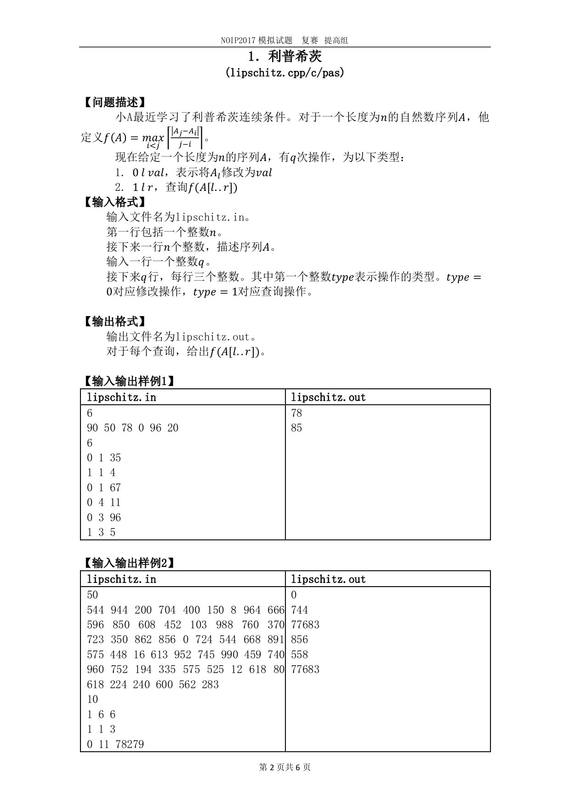
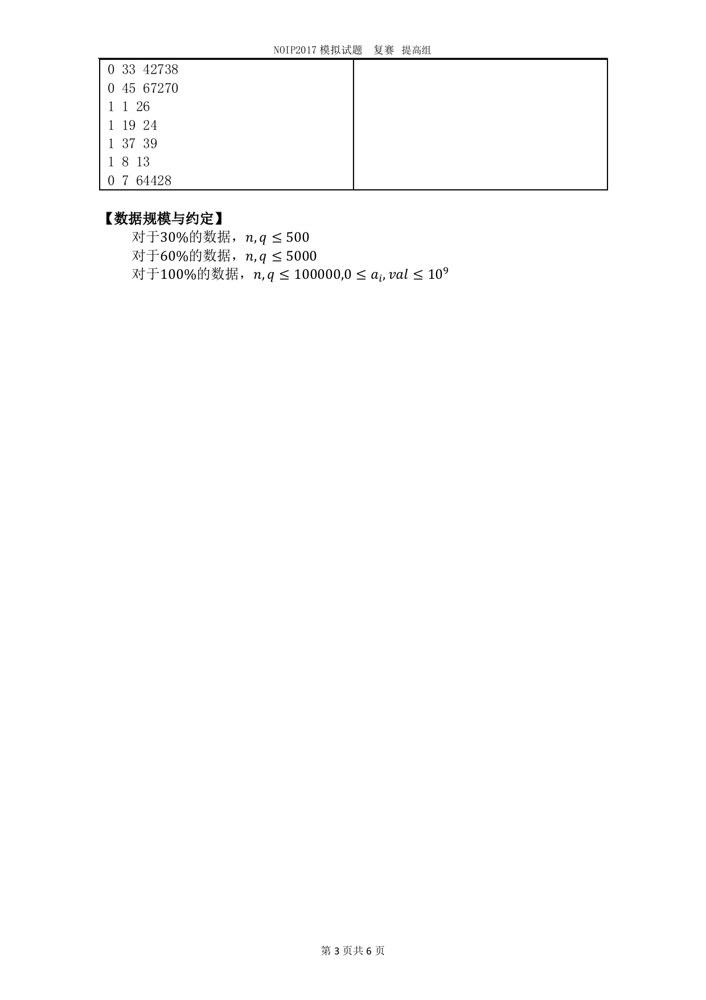
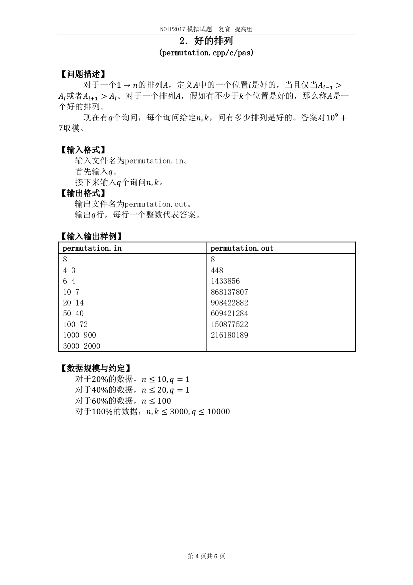
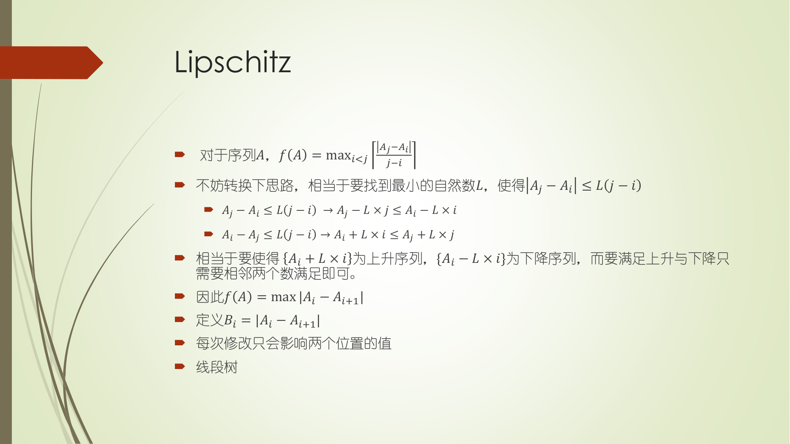
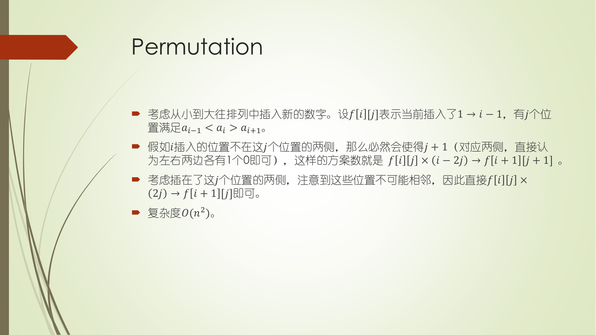
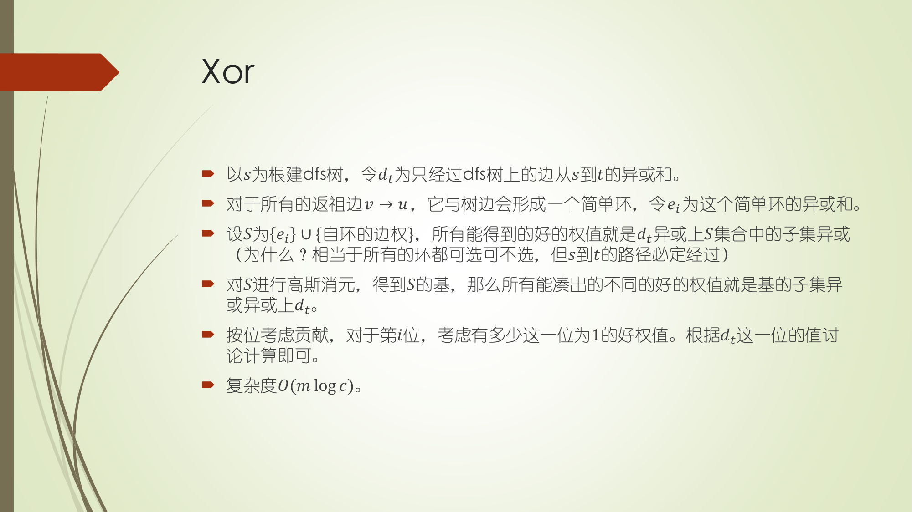

### 11-2 校内测试
_一日两考从今天正式开始_
### 1 上午







没什么好说的，自己太cai了。暴60。被学弟们爆cai。

关于第一题，思路着实巧妙。PZM提供了另一种思考的方法。把任意两个位置的分式看成一个直线（题目中提供的不就是一个斜率式子吗。）。可以证明对于一个位置$i$,只有$i - 1$与它组合更优。看’图‘：
```
             .
.     .      

j_____i-1____i
```
实在巧妙。如果不会大胆猜测，或者没有联想能力，根本不会发现这个性质。

第二题是一个组合数学题。发现自己的数学功底还是太差了，推了半天的式子还是一场空。在本题中，要注意仔细分析题目性质，把正面问题转换成反面问题（$a_i < a_{i+1} || a_i > a_{i - 1}$取反：$a_{i - 1}<=a_i>=a_{i + 1}$）。递推得到答案。同时，我们将大于等于转换成恰好，再搞一遍前缀和。一维递推不够再换成两维。

### 2 下午
考得心态爆炸，题目是一道除法分块：

F(n) = (n % 1) + (n % 2) + (n % 3) + ...... (n % n)。其中%表示 Mod，
也就是余数。
例如 F(6) = 6 % 1 + 6 % 2 + 6 % 3 + 6 % 4 + 6 % 5 + 6 % 6 = 0 + 0 +
0 + 2 + 1 + 0 = 3。
给出 n，计算 F(n), 由于结果很大，输出 Mod 1000000007 的结果即可。

