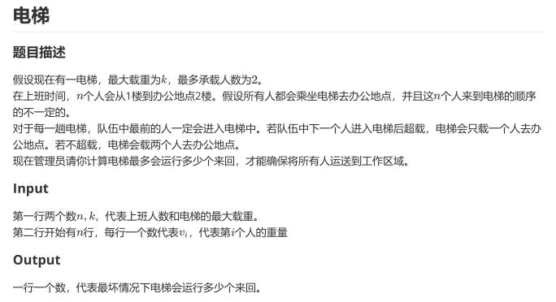
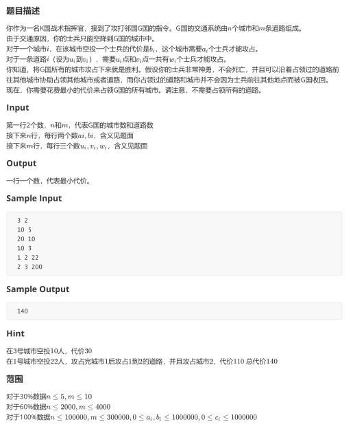
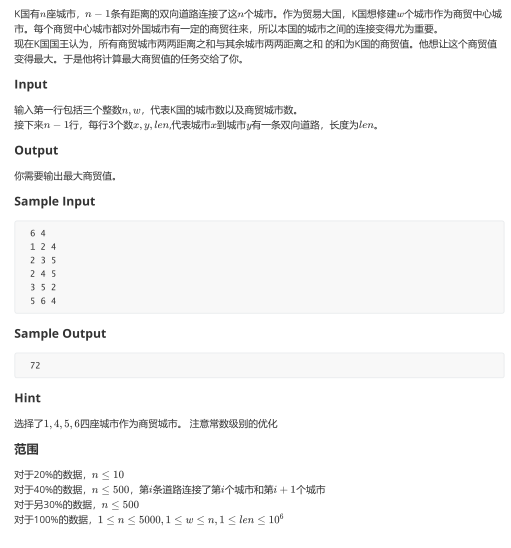

### XJOI联考
9:30了。本来我满怀激情的把今天XJOI联考的前两道题目写完，打算开T3。但是一股无名的力量把我拉下了堕落的深渊，我便再也没有精神去写题目了。写BLOG是一种搞颓的方式。我今天业已写了两篇博客了。

不得不说，XJOI联考的题目质量很高。

### 1 电梯



一道贪心题。作为D2T1再合适不过。很可惜的是，我还是没能写出来。正解：

不难发现，为了让次数尽量的多，只有两种情况：

* 小 配 小。（在同一个电梯里面）。
* 大 配 小。（因为超载，两者只能分成两批）。

排序之后维护左右指针即可。

```cpp
#include<bits/stdc++.h>
const int N = 1e5 + 3;
 
inline int read()
{
    int s{0},f{1}; char ch;
    while(!isdigit(ch = getchar())) if(ch == '-')f= -1;
    while(isdigit(ch)) s = s * 10 + ch - '0',ch = getchar();
    return s * f;
}
int a[N],n,k,times{0};
 
int main()
{
    n = read(),k = read();
    for(int i = 1;i <= n;i++) a[i] = read();
    std::sort(a + 1,a + 1 + n);
    int l = 1,r = n;
    while(l <= r) {
        /*FIXME*/
        if(l == r) {times++; break;}
        if(a[l] + a[r] > k)  {
            l++,r--;
            times += 2;
        } else {
            l += 2;
            times += 1;
        }
    }
    printf("%d",times);
    exit(0);
}
```

### 2 占领


我先想到的是构造一棵最小生成树，之后在树上操作。因为不难发现，若是在方案中需要调用士兵，那么他们经过的路径必然是边权最大值最小的路径，也就是最小生成树的树边。但是之后我们怎么操作？冷静分析一下：

我们定义一个集合 $(V,E)$，只考虑这个集合本身，给一个点派兵并经过道路攻占所有 $V$ 的代价 $f(V,E)$ 是：

$$f(V,E) = (\max_{i\in V}a_i + \max_{i\in V}w_i)\cdot (\min_{i\in V} b_i)$$

在许多情况下，$f(V,E)$并不是最小的代价。考虑存在最小代价的另一种情况可能是：我们并不需要通过最大边权的边沟通兵力（无论如何，每个点的a、b必然会被计算到贡献中，但是边权有些可以不考虑），所以我们去掉最大边后，让原来的问题转换成若干个联通块代价的和。

这其实就是kruscal算法的逆过程。

```cpp
#include<bits/stdc++.h>
#define int long long
const int N = 1e5 + 3,M = 3e5 + 3;

inline int read()
{
	int s{0},f{1}; char ch;
	while(!isdigit(ch = getchar())) if(ch == '-') f = -1;
	while(isdigit(ch)) s = s * 10  + ch - '0',ch = getchar();
	return s * f;
}

struct Edge{int x,y,z;} e[M << 1];

inline bool cmp(Edge e0,Edge e1)
	{return e0.z < e1.z;}
int a[N],b[N],v[N],n,m;

int fa[N];
inline void init() {for(int i = 1;i <= n;i++) fa[i] = i;}

inline int get(int x)
{
	if(fa[x] == x) return x;
	return fa[x] = get(fa[x]);
}

inline int solve()
{
	std::sort(e + 1,e + 1 + m,cmp);
	init();
	for(int i = 1;i <= n;i++) v[i] = a[i] * b[i];
	for(int i = 1;i <= m;i++) {
		int fx = get(e[i].x),fy = get(e[i].y);
		if(fx == fy) continue;
		fa[fx] = fy;
		a[fy] = std::max({a[fx],e[i].z,a[fy]});
		b[fy] = std::min(b[fx],b[fy]);
		v[fy] = std::min(v[fx] + v[fy],a[fy] * b[fy]);
	}
	int ret{0};
	/*the graph might be a forest*/
	for(int i = 1;i <= n;i++) if(fa[i] == i) ret += v[i];

	return ret;
}

signed main()
{
#ifdef CLANG
	freopen("occupied.in","r",stdin);
	freopen("occupied.out","w",stdout);
#endif
	n = read(),m = read();
	for(int i = 1;i <= n;i++)
		a[i] = read(),b[i] = read();
	for(int i = 1;i <= m;i++)
		e[i].x = read(),e[i].y = read(),e[i].z = read();
	printf("%lld\n",solve());
	exit(0);
}
```

### 3 商贸往来

没什么好说的，树上分组背包裸题。可是我太cai了，还是不知道做。
[code](docs/trade.cpp.html)